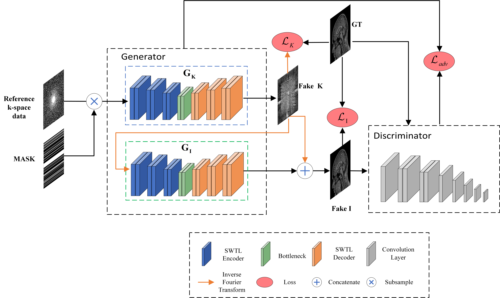

# SwinGAN

Official PyTorch implementation of SwinGAN described in the paper "SwinGAN: A Dual-domain Swin Transformer-based Generative Adversarial Network for MRI reconstruction".

<div align="center">

</div>

## Dependencies

```
python>=3.6.9
torch>=1.7.1
torchvision>=0.8.2
cuda=>10.1
Pillow == 6.2.1
PyYAML == 5.3.1
h5py == 2.10.0
ipython == 6.0.0
matplotlib == 3.1.1
numpy == 1.17.3
scipy == 0.19.1
tqdm == 4.37.0
nibabel == 2.2.1
ninja
```

## Installation
- Clone this repo:
```bash
git clone https://github.com/learnerzx/SwinGAN
cd SwinGAN
```

## Train

<br />

```
python3 train.py 

```


## Test

<br />

For IXI dataset
```
python3 origin_predict.py
```
For MICCAI 2013 dataset
```
python3 M2013_predict.py
```

<br />
<br />


# Citation
You are encouraged to modify/distribute this code. However, please acknowledge this code and cite the paper appropriately.
```
@article{ZHAO2023106513,
title = {SwinGAN: A dual-domain Swin Transformer-based generative adversarial network for MRI reconstruction},
author = {Xiang Zhao and Tiejun Yang and Bingjie Li and Xin Zhang},
journal = {Computers in Biology and Medicine},
year = {2023},
volume = {153},
pages = {106513},
doi = {https://doi.org/10.1016/j.compbiomed.2022.106513}
}
```

<br />

# Acknowledgements

This code uses libraries from [KIGAN], [SwinTransformer],[PatchGAN] repositories.
